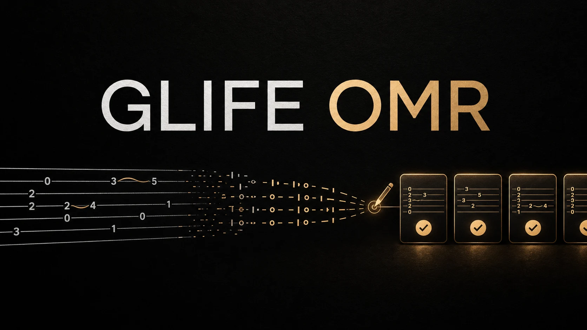
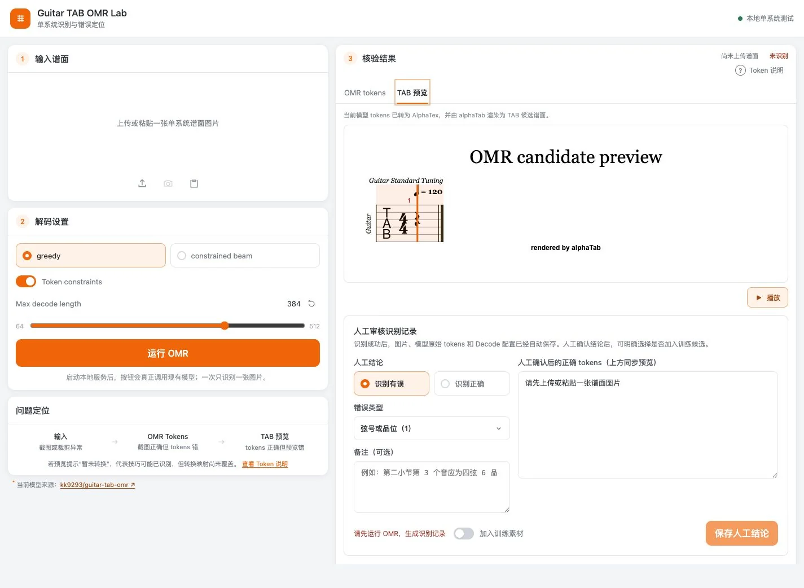

<div align="center">

# Glife OMR

**把吉他六线谱图片变成可核验、可积累的 OMR 训练候选。**



[](LICENSE)


</div>

Glife OMR 是一个本地运行、人工参与核验的吉他六线谱识别工作台。它把单系统谱面图片交给 OMR 模型，展示模型 tokens 和 alphaTab 谱面预览，再把人工确认结果保存为可追溯记录；只有明确勾选后，记录才会进入训练候选清单。

> 当前仍处于识别与数据积累阶段。训练候选不等于已经参与训练的数据，本项目也不宣称已达到生产级识别准确率。

## 工作台



工作台默认空白启动，不自带或自动加载任何谱面。上传或粘贴一张单系统 PNG、JPEG 或 WebP 图片后，可以：

- 使用 greedy 或 constrained beam 解码，并限制最大 token 长度；
- 对照模型原始 tokens、alphaTab 谱面和播放结果定位问题；
- 标记“识别有误”或“识别正确”，保存人工确认后的正确 tokens；
- 按需记录错误类别和备注；
- 明确选择是否加入训练素材，避免把普通核验记录自动混入候选数据集。

## 数据流

```text
单系统谱面图片
      ↓
OMR 推理 → Prediction Record（原始预测与配置）
      ↓
人工核验 → 正确 tokens + 结论 + 可选备注
      ↓                  └─ 未勾选：仅留作核验记录
格式与词表校验
      ↓
Training Candidate（训练候选，尚未训练）
```

人工备注用于说明错在什么位置、为什么修正，方便复核和后续分析；它是元数据，不会直接作为模型监督标签。真正参与候选数据集的是谱面图片、模型原始预测、人工确认 tokens 和版本化标签规则。

## 快速开始

本项目当前按本地研究工具运行。本机验证环境为 macOS、Python 3.11.15 和 CPU 推理。

```bash
python3 -m venv .venv-omr
source .venv-omr/bin/activate
pip install -r requirements.txt

mkdir -p vendor
git clone https://github.com/LIU9293/guitar-tab-omr vendor/guitar-tab-omr

hf download kk9293/guitar-tab-omr best.pt config.json vocab.json \
  --local-dir models/guitar-tab-omr

python scripts/run_local_omr_ui.py
```

然后打开 [http://127.0.0.1:8765/review/omr-workbench.html](http://127.0.0.1:8765/review/omr-workbench.html)。模型权重、人工核验数据和运行产物均保留在本机，不纳入 Git 仓库。

运行轻量测试：

```bash
PYTHONPATH=scripts .venv-omr/bin/python -m unittest \
  scripts/test_omr_record_store.py \
  scripts/test_run_local_omr_ui.py
```

## 当前边界

- 面向裁切好的、单系统数字吉他六线谱，不是通用 OCR 或整页自动分谱工具；
- alphaTab 预览用于核验转换结果，不等同于完整的乐谱编辑器；
- 识别错误、暂不支持的 token 和正确样本都可以记录，但是否进入训练候选由人工明确决定；
- 后续会在更多真实谱面上持续积累候选样本，完成数据复核后再开展训练、评估和版本对比。

## 致谢与来源

Glife OMR 建立在以下开源项目与公开模型之上，谨向作者和贡献者致谢：

- [kk9293/guitar-tab-omr](https://huggingface.co/kk9293/guitar-tab-omr)：提供吉他 TAB OMR 模型权重、配置与模型说明；
- [LIU9293/guitar-tab-omr](https://github.com/LIU9293/guitar-tab-omr)：提供模型架构、训练与推理代码；
- [alphaTab](https://github.com/CoderLine/alphaTab)：提供谱面渲染和播放能力；
- [Bravura](https://github.com/steinbergmedia/bravura)：提供音乐符号字体；
- Sonivox SoundFont：提供本地播放音色，随附 Apache-2.0 许可说明。

本仓库不重新分发上游模型权重或模型推理代码。请从对应上游页面获取，并在使用或再分发前核对其最新许可条件。第三方资源的具体版权与许可见 [THIRD_PARTY_NOTICES.md](THIRD_PARTY_NOTICES.md)。README 头图由 OpenAI 图像生成工具为本项目生成。

## License

Glife 原创代码以 [MIT License](LICENSE) 发布；第三方模型、代码、字体、音色和其他资源不受该 MIT License 覆盖，分别遵循其各自许可。
